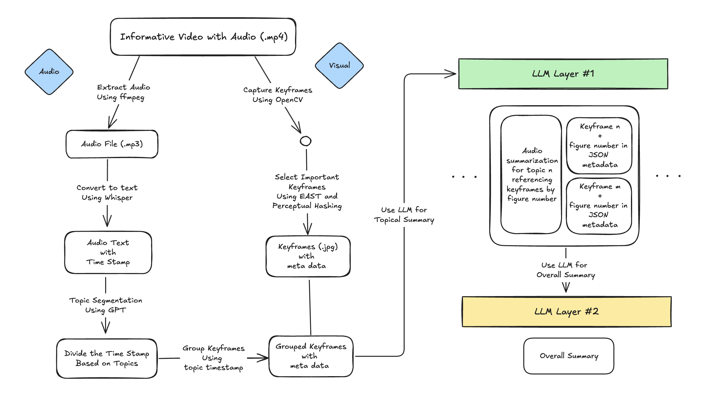

# Video Summarization for Information-Dense Content
This repository summarizes a project I worked on during my time at **WebAI**, as part of a contract with the **Open Project at UC Berkeley**. Since the work involved building an early test model that could potentially be integrated into "Navigator," their main AI model, I'm not sharing the actual code here. Instead, I've documented the overall pipeline, important technical decisions I made, the key challenges, and the parts I was directly responsible for.

## Project Overview
### Objectives
This project focuses on building a pipeline that accurately summarizes information-dense video content. The initial goal is to develop an early test model that could later be expanded to help WebAI Navigator users quickly understand key points without watching the entire video. The pipeline is designed to extract meaningful audio and visual information while keeping the output accurate, relevant, and easy to understand.

### Target Video: information-dense Video (with texts in videos)
While exploring where keyframe extraction is acutally necessary, it became clear that not all videos need keyframes. If a video has minimal visual changes or the visuals don't contain meaningful information, audio based summarization alone is usually sufficient.

However, information-dense videos often include important visual elements such as text, graphs, charts, and diagrams that cannot be captured through audio only summarization.

Another practical point is user behavior. People generally won't use a summarization feature for short or purely entertainment focused videos. Summarization is most useful when a video is long, includes much information, and covers several subtopics.

### Use Cases
- When users want a quick preview of the content before watching the video.
- When users need a summary after watching to review and reinforce key points.
- When users want to understand the main ideas without watching the full video.

## Pipeline Overview

1. **Extract Important Keyframes**

    Uses OpenCV to extract potential keyframes, applies the EAST text detector to find frames containing meaningful text, and uses perceptual hashing to remove similar frames.

2. **Extract Audio, Transcribe, and Segment**

    Extracts audio using ffmpeg, transcribes using Whisper, and segments the transcript into topic based sections.

3. **Topical Summaries**

    Uses an LLM with a structured prompt to generate summaries for each topic segment, combining both audio summaires and the associated keyframes.

4. **Overall Summary**

    Uses an LLM with another prompt to create a final overall summary that condenses the main ideas of the entire videos.

## Tech Stack
- **Computer Vision**: OpenCV, EAST text detector, Peceptual Hashing (pHash)
- **Audio Processing**: ffmpeg, Whisper
- **Summarization**: LLM based summarization, prompt engineering for topic level and overall summaries
- **Generall**: Python, Hugging Face, Github, Google Colab, Visual Studio Code

## My Key Contributions
I was mainly in the visual team, but our work extended beyond keyframe extraction and we played a major role in designing the overall pipeline and coordinating with the audio and LLM teams.

### 1. Defining When Keyframes Are Necessary
- Decided to focus on information-dense videos where visuals include essential meaning.
- Established the reasoning behind combining audio and visual information for accurate summarization.

### 2. Designing the Multimodal Pipeline
- Pipeline Flow Design: Keyframe extraction & Audio transcription -> topic segmentation -> LLM summarization
- Worked with the audio team to align segmentation with visual context
- Collaborated with the LLM team to design how keyframes would be incorporated into prompts.

### 3. Implementing Keyframe Extraction
- Implemented the keyframe extraction process using OpenCV, EAST text detection, and perceptual hasing.
- Tested differeent methods and Tuned thresholds to capture meaningful frames and remove similar frames.

## Challenges & Solutions
### Challenge 1: Segmenting Topics Acorss Keyframes
**Problem**: It was difficult to automatically identify where each topic starts and ends using keyframes alone.

**Solution**: Used timestamps from the audio transcript to align keyframes with topic, enabling accurate topic based segmentation.

### Challenge 2: Removing Redundant or Similar Keyframes
**Problem**: Many keyframes lookes almost identical when the visuals barely changed. Additionally, in slide based presentations, slides often use animation functions or incremental builds, where contents reveal step by step, but only the final fully revealed slide is meaningful.

**Solumtion**: 
- **YOLO**: Selected keyframes when the object count or object types changed beyond a threshold.
- **OpenCV (SSIM)**: Filterd out similar frames using similarity scores and threshold.
- **EAST + Perceptual Hashing**: Tested text detection and hashing methods to retain meaningful frames while removing redundant ones.

After evaluating all threes methods, we selected EAST + perceptual hasing as it performed the best.

## Impact & Result
The pipeline, which combines audio based topic segmentation with meaningful keyframes, allowed users to understand the main ideas without watching the entire video. In practice, this reduced the time by roughly **60-70%**, depending on the length and structure of the video.